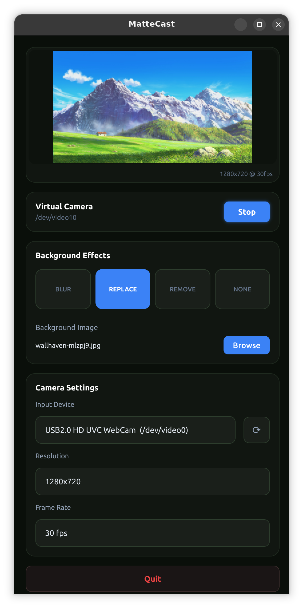
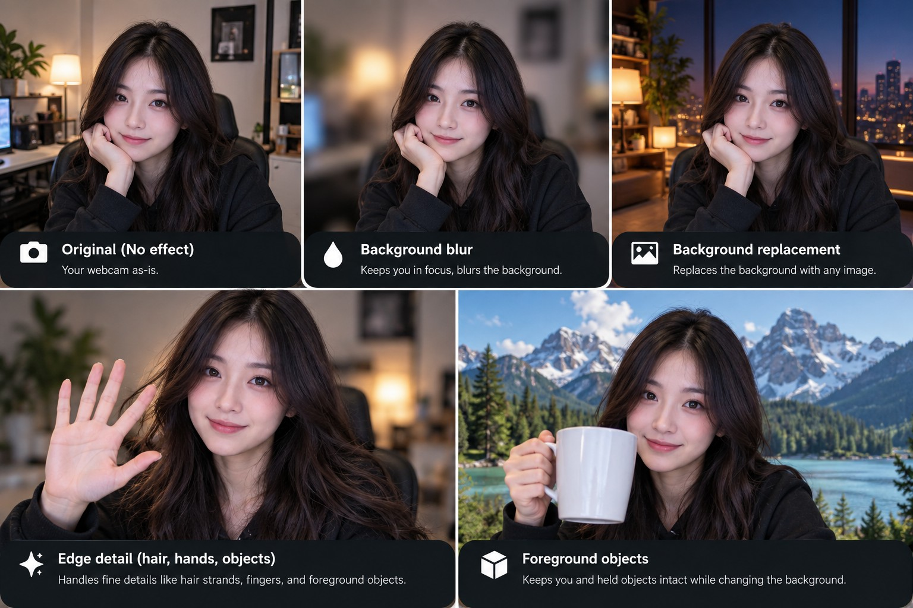

<div align="center">
  
  <h1>MatteCast</h1>
  <p><strong>Real-time AI background effects for a Linux virtual camera.</strong></p>
  <p>Robust Video Matting (RVM) · ONNX Runtime CUDA · v4l2loopback · Podman/Docker</p>
  <p><strong>Current release: v1.0.0</strong></p>
  
</div>

MatteCast turns a physical webcam into a GPU-accelerated Linux virtual camera with
real-time background blur, removal, and replacement. It uses the recurrent
MobileNetV3 variant of [Robust Video Matting](https://github.com/PeterL1n/RobustVideoMatting)
through ONNX Runtime and writes the processed stream to `v4l2loopback`.

The current implementation is intentionally local-first and security-hardened:
the application image is built on the host, the runtime container has no network
access, and only the devices/directories required by MatteCast are exposed.

## Effect overview

<div align="center">
  
</div>

> **Illustrative preview.** This image is generated to demonstrate the intended
> effect categories and is not a frame captured from MatteCast or a quality
> benchmark. Actual matting quality depends on lighting, camera quality, subject
> motion, foreground/background contrast, and processing resolution.

## Features

- Real-time recurrent video matting with temporal state
- `BLUR`, `REPLACE`, `REMOVE`, and `NONE` modes
- NVIDIA CUDA acceleration through ONNX Runtime
- Physical-camera switching while the virtual camera remains active
- Camera format negotiation with MJPG preference where supported
- Consumer-aware virtual-camera resolution lock
- Persistent per-user settings
- Read-only background-image mount
- Local container build; no silently pulled MatteCast runtime image
- Rootless Podman support
- `/dev/video10` virtual-camera output by default

## Hardware and software requirements

The current implementation targets **Linux x86_64 with an NVIDIA GPU**.

| Component | Requirement | Validated configuration |
| --- | --- | --- |
| OS | Linux x86_64 | Ubuntu 24.04 LTS, Linux 6.14-series kernel |
| GPU | NVIDIA GPU supported by a proprietary driver capable of running the CUDA 12.8 userspace in the container | GeForce RTX 2050 4 GB |
| NVIDIA driver | Recent proprietary NVIDIA driver | 580.173.02 |
| CPU | x86_64 CPU with enough headroom for capture, preprocessing and compositing | Intel Core i5-13420H |
| System memory | No formal minimum established; leave at least ~1–2 GB of free headroom for MatteCast and the container runtime | ~756 MB container memory during the 720p soak test |
| Camera | V4L2/UVC capture device; MJPG is preferred for higher-resolution/high-FPS modes | Lenovo integrated camera; EMEET USB webcam (`328f:00ed`) |
| Container runtime | Podman or Docker with NVIDIA container GPU integration | Rootless Podman 4.9.3 |
| NVIDIA container integration | NVIDIA Container Toolkit / CDI or Docker NVIDIA runtime | NVIDIA Container Toolkit 1.20.1 |
| Virtual camera | `v4l2loopback` and `v4l-utils` | v4l2loopback 0.13.2 |
| Desktop session | `DISPLAY` plus `xauth`; X11 or XWayland | X11 |

A host CUDA toolkit is **not** required. CUDA/cuDNN userspace libraries are provided
inside the pinned container base image.

Other NVIDIA GPUs, distributions, cameras, container versions, and desktop
sessions may work, but the combinations above are the ones validated so far.

## Tested applications and devices

MatteCast has been exercised with:

- **Google Meet in Vivaldi/Chromium** — virtual-camera connect/disconnect,
  effects, physical-camera switching, and consumer detection
- **OBS Studio (V4L2 source)** — 1280×720 YU12 capture, effects,
  camera switching, FPS changes, reconnects, and consumer detection
- **Lenovo integrated webcam** — MJPG 1280×720 @ 30 FPS and 1920×1080 @ 30 FPS
- **EMEET USB webcam** — MJPG 1280×720 @ 30/60 FPS and 1920×1080 @ 30 FPS

A 30-minute OBS soak test at **1280×720 @ 30 FPS with background replacement**
showed, on the validated RTX 2050 system:

| Metric | Observed |
| --- | ---: |
| GPU utilization | ~25–56% |
| GPU memory | 627 MiB, stable |
| GPU temperature | 60–63 °C |
| Container memory | 756.2–756.5 MB |
| Container processes | 33, stable |
| Container CPU | roughly 1.9–2.0 CPU cores |

These are validation observations, not guaranteed performance targets. Results
will vary with camera format, effect, resolution, GPU, CPU, and background image.

## Architecture

```text
physical camera
    ↓
OpenCV capture (MJPG preferred)
    ↓
RVM MobileNetV3 ONNX
    ↓
alpha matte + recurrent state
    ↓
MatteCast compositor
    ├── blur
    ├── remove
    ├── replace
    └── none
    ↓
v4l2loopback virtual camera (YU12)
    ↓
OBS / browser / conferencing app
```

RVM recurrent tensors are preserved between consecutive frames. State is reset
when the camera or resolution is reconfigured, or when inference becomes inactive.

## Quick start

Before installing MatteCast, make sure the host has:

- a working proprietary NVIDIA driver (`nvidia-smi` should succeed);
- Podman or Docker;
- NVIDIA Container Toolkit / working GPU passthrough for the selected runtime.

Then:

```bash
# 1. Validate the source tree and bundled RVM model
./tests/run_tests.sh

# 2. Configure the virtual camera and build the local image
./install.sh

# 3. Launch
./run.sh
```

The repository includes the pinned RVM model used by MatteCast. If the model is
missing or you deliberately want to restore the known upstream artifact, run
`./scripts/fetch-rvm-model.sh`; the fetcher verifies its expected size and SHA-256
before installing it.

The installer can install common host dependencies such as `xauth`, `v4l-utils`,
and `v4l2loopback` on supported APT/DNF systems. It deliberately does not hide
NVIDIA driver/container-runtime setup behind a privileged bootstrap script.

Select **MatteCast Virtual Camera** in OBS, the browser, or conferencing application.

### RVM model integrity

MatteCast v1.0.0 includes the pinned RVM MobileNetV3 ONNX model in the repository
so a checkout does not depend on the upstream release remaining available.

```text
models/rvm_mobilenetv3_fp32.onnx
size:   14,975,696 bytes
SHA256: 88d4531297118f595bf2fd60f6f566aec2e559393802d1f436c380f0cbbd2828
```

The test suite verifies the expected size and SHA-256. The optional fetcher can
restore the pinned upstream artifact by downloading to a temporary file, verifying
it, and installing it atomically.

## Usage notes

1. Start MatteCast.
2. Select a physical camera.
3. Select `BLUR`, `REPLACE`, `REMOVE`, or `NONE`.
4. Choose a resolution and FPS supported by the physical camera.
5. Select **MatteCast Virtual Camera** in the consuming application.

Settings are stored at:

```text
~/.config/mattecast/settings.json
```

### Resolution changes while in use

Browsers and other V4L2 consumers generally do not renegotiate cleanly if the
virtual-camera format changes underneath an active stream. MatteCast therefore
**locks virtual-camera resolution while a consumer is attached**.

Effects, physical-camera switching, and supported FPS changes remain available.
Stop/disable the virtual camera in the consuming application before changing the
output resolution.

### Camera hotplug

Physical cameras are passed into the container explicitly at launch. A camera
plugged in after MatteCast starts will not appear merely by pressing refresh;
restart MatteCast so the new device can be exposed to the container.

This is intentional: MatteCast does not expose the entire host `/dev` tree.

## Background images

By default only `~/Pictures` is mounted into the container, read-only, at:

```text
/media/host
```

Use another dedicated directory with:

```bash
MATTECAST_MEDIA_DIR="$HOME/path/to/backgrounds" ./run.sh
```

Mounting `/`, `/home`, `/root`, or the entire home directory is refused unless
`MATTECAST_ALLOW_BROAD_MEDIA=1` is explicitly set.

## Security model

The default launcher is designed to minimize host exposure. It:

- builds/uses a local MatteCast image rather than silently pulling a mutable runtime;
- runs with `--network none`;
- uses private IPC;
- drops all Linux capabilities;
- enables `no-new-privileges`;
- uses a read-only container root filesystem;
- provides a bounded `noexec,nosuid,nodev` `/tmp` tmpfs;
- exposes only capture-capable V4L2 devices plus the MatteCast virtual camera;
- does not mount the whole home directory;
- mounts background images read-only;
- does not expose session D-Bus or `/dev/dri` unless explicitly requested;
- uses an isolated X11 authorization cookie rather than broad `xhost` access;
- uses private per-user runtime files and a mode-`0600` command FIFO;
- validates the virtual-camera identity before use;
- verifies the RVM model and ONNX Runtime archive by SHA-256;
- installs hash-pinned PySide/Shiboken GUI wheels;
- does not install passwordless `sudo` rules.

Rootless Podman is the preferred runtime when available. Docker is supported,
but membership of the Docker daemon group typically grants root-equivalent host
control and should be treated accordingly.

See [SECURITY.md](SECURITY.md) and [HARDENING_NOTES.md](HARDENING_NOTES.md).

## Optional compatibility switches

These expand host exposure and are disabled by default:

```bash
# Session D-Bus access, only if tray/desktop integration requires it.
MATTECAST_ENABLE_DBUS=1 ./run.sh

# Expose /dev/dri only if the display environment requires it.
MATTECAST_ENABLE_DRI=1 ./run.sh

# Disable SELinux labeling only when SELinux specifically blocks required mounts.
MATTECAST_DISABLE_SELINUX_LABEL=1 ./run.sh

# Use another already-local image only after an explicit trust opt-in.
MATTECAST_IMAGE=my-image@sha256:... MATTECAST_ALLOW_CUSTOM_IMAGE=1 ./run.sh
```

A non-default virtual-camera path can be selected consistently at install and runtime:

```bash
MATTECAST_VCAM_DEVICE=/dev/video42 ./install.sh
MATTECAST_VCAM_DEVICE=/dev/video42 ./run.sh
```

## Known limitations

- **NVIDIA-only today.** The current ONNX Runtime path is configured for CUDA.
- **Linux x86_64 only.** Other architectures have not been validated.
- **X11/XWayland required.** The hardened launcher currently relies on `DISPLAY`
  and an isolated Xauthority cookie; a native Wayland path is not implemented.
- **Camera hotplug requires restart.** New V4L2 devices are not added to an
  already-running container.
- **Output resolution is locked while consumed.** This avoids breaking active
  WebRTC/OBS streams that do not dynamically renegotiate V4L2 format changes.
- **Performance optimization is not finished.** ONNX Runtime I/O Binding and an
  FP16 model path are not enabled yet; the validated 720p workload used roughly
  two CPU cores despite GPU inference.
- **The virtual-camera output is YU12.** Consumers must support the negotiated
  V4L2 format.

## Tests

Run the non-hardware suite with:

```bash
./tests/run_tests.sh
```

The suite currently covers:

- shell and Python syntax;
- command parsing and deterministic fuzzing;
- RVM math/compositing helpers;
- C++ compilation against API-compatible stubs;
- settings/FIFO/runtime-path hardening;
- model/dependency integrity assertions;
- host configuration safety;
- sanitizer fuzzing;
- security regressions;
- source-tree hygiene;
- the zero-consumer `lsof` watcher regression.

The tests intentionally avoid modifying the host and do not require an NVIDIA GPU.
A real GPU/camera/consumer validation is still required for a new environment.

## Virtual camera configuration

By default the installer owns only these project-specific files:

```text
/etc/modules-load.d/83-mattecast-v4l2loopback.conf
/etc/modprobe.d/83-mattecast-v4l2loopback.conf
/etc/udev/rules.d/83-mattecast-vcam.rules
```

The default virtual camera is:

```text
/dev/video10
MatteCast Virtual Camera
```

The udev rule uses:

```text
GROUP="video", MODE="0660", TAG+="uaccess"
```

MatteCast does not automatically unload a global `v4l2loopback` module that may
belong to another application. If conflicting module options are found, installation
stops rather than overwriting them.

## Migrating from BluCast

MatteCast is the renamed successor to the hardened RVM-based BluCast tree.
The installer recognizes only exact, known legacy BluCast configuration before
performing automatic cleanup/migration.

If `BluCast Virtual Camera` is still loaded during migration, the installer:

1. writes the MatteCast-specific module/udev configuration;
2. removes only exact legacy BluCast configuration it can prove ownership of;
3. leaves the currently loaded global kernel module alone;
4. requests a one-time reboot so the device returns as `MatteCast Virtual Camera`.

Existing settings are migrated from `~/.config/blucast` only when
`~/.config/mattecast` does not already exist.

## Troubleshooting

### Virtual camera permission denied

```bash
ls -l /dev/video10
getfacl /dev/video10 2>/dev/null
```

A logout/login may be required after device-access rule changes. Do not use
`chmod 666` as a workaround.

### Podman cannot resolve `nvidia.com/gpu=all`

MatteCast uses NVIDIA CDI with Podman. Verify:

```bash
nvidia-ctk cdi list
```

On systems requiring a manual CDI spec generation, consult the NVIDIA Container
Toolkit documentation for the installed toolkit/Podman versions. Older Podman
versions may not understand newer CDI spec versions.

### ONNX Runtime CUDA initialization fails

Check the host driver first:

```bash
nvidia-smi
```

The current container uses CUDA 12.8/cuDNN 9 userspace. The host driver must be
new enough to support that userspace.

### SELinux mount denial

Keep the confined default first. Only if SELinux specifically blocks required
X11/bind mounts, retry with:

```bash
MATTECAST_DISABLE_SELINUX_LABEL=1 ./run.sh
```

## Uninstall

```bash
./scripts/uninstall.sh
```

The uninstaller removes MatteCast-owned host configuration and exact known legacy
BluCast artifacts. Modified/unrecognized administrator-owned files are left alone.
The currently loaded global `v4l2loopback` module is not unloaded automatically.

## Licensing

MatteCast source code is distributed under the MIT license in [LICENSE](LICENSE).

Third-party software and model terms are separate. The bundled
`models/rvm_mobilenetv3_fp32.onnx` artifact is **not** covered by MatteCast's MIT
license. The upstream Robust Video Matting project states that its code and
pretrained models are published under GPL-3.0. Review
[THIRD_PARTY_NOTICES.md](THIRD_PARTY_NOTICES.md) before redistributing the model
or a container/image that contains it.
